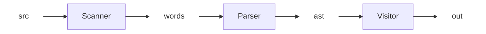

# Roadmap

This document tracks the current state of the project and outlines 
where it is heading. The goal is to incrementally build a clean, 
understandable compiler pipeline while keeping the architecture flexible.

---

## Current Focus

The immediate goal is to complete a minimal end-to-end pipeline: source 
code in, structured representation out.

At a high level, the data flows through the following stages:

**Stage intent (briefly):**
- `src`: raw source code defined in [`language.md`](language.md)
- `Scanner`: converts characters into words
- `Parser`: builds a structured representation
- `ast`: abstract syntax tree
- `Visitor`: performs operations over the AST (e.g. codegen)
- `out`: result of the chosen visitor

The emphasis here is correctness and clarity, not performance or feature completeness.

---

## Future Work

Once the basic pipeline is solid, the next steps will focus on depth and extensibility rather than breadth. Possible directions include:

- More expressive AST node types

- Multiple visitors (e.g. pretty-printer, interpreter, type checker)

- Error handling and diagnostics as first-class concepts

- Better separation between syntax and semantics

- Tooling around the pipeline (tests, visualizations, debugging helpers)

These are intentionally vague for now. The design should emerge from pressure applied by real use cases, not from premature abstraction.